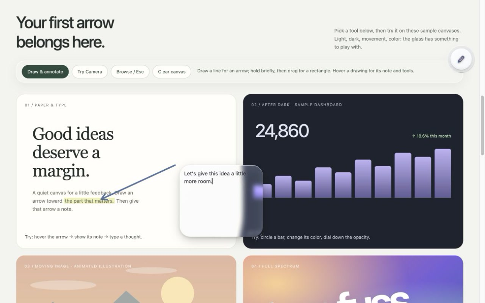
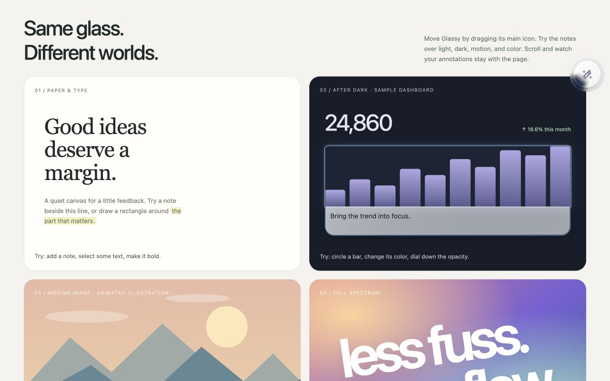
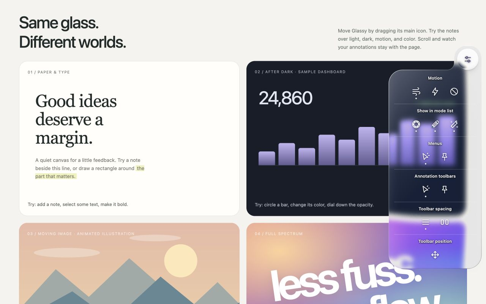

# 0.2.0 release review — 2026-10-03

**Historical review.** Current two-mode source, final package, refreshed media
and checks are recorded in [2026-10-04 readiness](RELEASE_READINESS.md).
The observations below belong to an older four-mode build.

**Superseded build notice:** the subsequent [Camera iteration](CAMERA_REVIEW.md)
changes runtime source after the ZIP reviewed below. That existing ZIP is a
point-in-time artifact, **not an upload candidate for the current source**.
No replacement ZIP or publication was requested during the Camera iteration.

**Outcome: release candidate prepared; publication is still pending.**
The public repository and Store remain on their existing published content.
No commit, push, deployment, Store upload, or certification was performed.
The approved liquid-glass surface and directional interaction were retained.

## Build and environment

| Item | Evidence |
| --- | --- |
| Source | Working tree on `codex/v02-hover-capture-annotations`, based on `6d668f0`; includes the existing design iterations plus this review. |
| Extension candidate | `dist/glass-feedback-0.2.0.zip`, 12 allowlisted runtime files, about 92 KiB; manifest at archive root. |
| SHA-256 | `37ea11a62979de7fed65f066937471d2a5ddf288255b84e66b71f6264a094e8c` |
| Real browser | Installed unpacked extension, Google Chrome 154.0.8037.93 arm64, macOS 27.0.1; 100% zoom, device scale 2 and 1352-CSS-pixel width inferred from the export. Native viewport height was not separately recorded. |
| Shared-UI preview | HTTP-served `tools/demo.html`, in-app browser; 1280×800 and 360×640 viewports. |
| Automated checks | `npm run validate`: static checks and **57 passing Node tests**; no skipped tests. Tests use mocked browser APIs/VM state-machine seams, not a real browser. |
| Package checks | ZIP integrity passed; every archived file byte-matched source. The tooling reviewer also observed identical ZIPs across repeated builds. |

Native exports were inspected during this review, not inferred from a demo
simulation. The final inline-footer contrast adjustment was then verified in
the shared UI. Native capture code did not change after the export checks.
The existing unpacked `dist/glass-feedback-0.2.0` folder was refreshed from the
candidate ZIP. Reload that extension and the page after subsequent edits.

## Observed user journey

“Observed” below is scoped to the stated actions, not a blanket feature pass.

| Step | Health | What was checked |
| --- | --- | --- |
| 1. Activate on a page | Observed | Native extension action opens one Glassy on the local fixture, on a strict-CSP version of that fixture, and on the public GitHub repository. `chrome://extensions` shows the custom unavailable-page explanation. |
| 2. Discover/select a mode | Partial | Camera, Annotate, Wand, and Settings were reached through arrow-key menus and activation; native Camera/Annotate click selection worked. Settings expands automatically. All four slow directional pointer pulls and hover-and-leave timing still need a dedicated hands-on pass. |
| 3. Make annotations | Observed subset | Editable light note, one-off freehand/rectangle placement, rectangle color change, default returning to notes, and shared item controls were exercised. A real Chrome note was included in a full-page image without its editing controls. Move/resize, formatting, multi-item deletion, and every opacity combination were not exhaustively retested. |
| 4. Attach element feedback | Observed subset | Wand Color wash/Inline defaults, target selection, inline text editing, and target-linked footer were exercised in the preview. A clean sample was captured. Regular-note Wand placement and every selection-toolbar operation remain on the manual checklist. |
| 5. Configure controls | Observed subset | Liquid/Snappy/Off choices, hide/show Wand, hover/pinned menus and toolbars, Compact/Roomy, and Reset position. At 360×640 the options panel fits within x=104…348 and y=184…628; its longer content scrolls. Motion taste, every corner, and all preference combinations still need hands-on review. |
| 6. Capture/export | Observed | Real region → clipboard PNG opened in Preview; real Full page → downloaded PNG inspected at 2704×4200, containing all three 700-CSS-pixel fixture sections. Scroll returned to the prior light section. A second image contained the note at its document position. Clipboard denial/download failure cleanup is additionally covered by Node tests, not a forced live-browser denial. |
| 7. Release/reactivate page | Observed | Esc releases the tool; native and preview controls show inactive state after inactivity and click reactivates them. Node tests establish the exact 30-second deadline, meaningful-use reset, and protection of active gestures/captures. |
| 8. Try before installing | Observed | Demo starts in browse state; Try annotating works without a Camera click intercept. The latest Camera region confirmation shows a readable extension-only notice and Store link. `?extension=1` loads the canvases without demo UI/API stubs for native testing. |
| 9. Prepare the listing | Prepared | Three exact-size, no-alpha JPEG screenshots, a 440×280 small promo, and the existing 128×128 PNG icon. Source-grounded listing copy, user guide, privacy/Limited Use disclosure, changelog, and public-safe bug-report form. Dashboard fields and public publication are untouched. |

Local native export evidence is retained under
`output/playwright/release-2026-10-03/` (ignored generated artifacts):
`04-real-region-clipboard.png`, `05-real-full-page.png`,
`08-real-full-page-annotated.png`, and `06-native-unavailable.png`.
The region evidence is a 470×200 PNG. The full-page images are 2704×4200 PNGs.
The preview also records narrow settings and the final demo export notice.

## Current screenshot evidence

These are current-run captures of the same UI source used by the extension,
with project-authored sample content. They do not imply that the demo performs
real screenshot export. Saved files were opened and visually inspected.

## Fixes and cleanup from this review

| Finding | Change |
| --- | --- |
| Armed Camera swallowed the demo's first CTA | Start the demo disarmed; pass explicitly tagged demo controls through the page-tool overlay. Jump to the canvas immediately so scrolling does not cancel a fast first gesture. |
| Preview paths assumed a domain-root deployment | Resolve bundled files relative to the repository root; add a stub-free extension playground. Remove obsolete fake screenshot/download success paths. |
| Host-page cursor CSS was unnecessary | Keep the custom cursor on the isolated tool/selection overlays; no global page-wide cursor style. Drawing/rectangle layers suppress touch panning during a stroke. |
| Menu/default changes could disturb active state or focus | Avoid reselecting the current mode merely to change a default; restore focus to the selected recent-color control after rebuilding options. |
| Feedback text disappeared over light/dark content | Give setting labels/selected dots stronger edge contrast, notices a translucent dark backing, and inline Wand footers a minimum 72% note backing. Regular light notes retain their 15% default. This improves observed legibility; it is not a contrast-compliance claim. |
| Worker/archive trust boundaries were loose | Require successful main-frame activation acknowledgements, trusted main-frame requests, active unchanged capture tabs, and PNG/relative download paths; validate the staged archive, reject symlinks/unexpected permissions/runtime dependencies. |
| Verification/documentation described an older UI | Retire stale browser runners in favor of explicitly NOT RUN checklists; add current content tests and mark old verification as historical. Refresh documentation, Store copy, graphics, and support intake. |

The Product Design audit skill prompted screenshot-grounded checks of the first
CTA, contrast, and narrow layout. It did not introduce a visual redesign.
GitNexus was unavailable; scoped source inspection and regression tests were
used instead. No new runtime dependencies were added.

## Remaining gates and bounded follow-ups

| Priority/owner | Task | Budget |
| --- | --- | --- |
| Before publication — maintainer | Slow pointer pulls from all sides/corners; hover-and-leave switching; notes/drawings/Wand toolbars, color, deletion, move/resize and text formatting; narrow/pinned combinations. Keep the visual personality as the acceptance criterion. | 20 minutes |
| Before publication — maintainer | Review privacy/data categories and Limited Use certification in the actual dashboard. Merge/publish the policy before using its public URL; verify listing/support ownership/contact details and final graphics. | 15 minutes |
| Before publication — maintainer | Commit/review/merge the changes, rerun validation/package after any fixes, upload the runtime ZIP and separate graphics, submit for review with deferred publication if desired. | 15 minutes, excluding Store review |
| Tracked follow-up — engineering, issue #2 | Obtain safe reproduction URLs for previously failing websites. Exercise dynamic/sticky/virtualized pages, frames, navigation/tab switches, resize and very large outputs. The local CSP and GitHub checks are not universal website coverage. | 30 minutes per initial site batch |
| Tracked follow-up — product/docs, issue #1 | Complete keyboard-only, screen-reader, reduced-motion/forced-color and touch review; record a short final walkthrough and host the demo only after choosing its destination/data practices. | 30 minutes accessibility + 20 minutes walkthrough/hosting |

The repository is already public. Its live About section has no description,
website, or topics, and no license file is present locally. Prepared About copy:
“Liquid-glass page annotations, element feedback, and screenshot export for
Chrome.” Suggested topics: `chrome-extension`, `annotations`, `liquid-glass`,
`screenshot`, `javascript`. Set the website only once the demo has a real public
URL. License choice belongs to the owner and was requested; no license was
invented. Branch protection and a versioned GitHub release are useful later
publication steps, not changes made by this review.

This review does not establish WCAG compliance, legal compliance, universal
website support, or Chrome Web Store approval. Known capture/anchor limits remain
in the [user guide](USER_GUIDE.md) and [README](../README.md).
