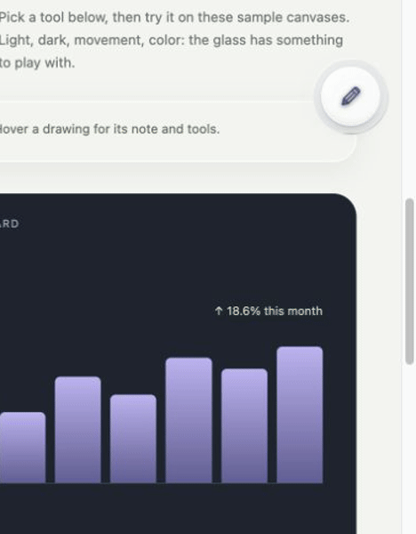

# 0.2.0 media kit

Captured on 2026-10-04 from the current shared UI at
`tools/demo.html`, with project-authored sample content.
This is a preview of upcoming 0.2, not evidence of Store publication or
native capture success.

The Store icon was updated on 2026-10-05 to the selected Glassy mascot
from `assets/brand/glassy-mascot-v1.png`, matching the bundled icons.
The interaction stills and video remain accurate: the mascot is branding,
not a replacement for the in-page Camera/Annotate control.

| File | Use |
| --- | --- |
| `store-icon-128.png` | Store icon, 128×128 PNG; matches bundled icon. |
| `01-annotate-1280x800.jpg` | Listing screenshot: arrow and associated note over light/dark content. |
| `02-controls-1280x800.jpg` | Listing screenshot: current Annotate options on the connected glass surface. |
| `03-camera-1280x800.jpg` | Listing screenshot: adjustable region and centered confirmation toolbar. No export-success claim. |
| `small-promo-440x280.jpg` | Small promo, branding and real UI sample. |
| `preview-poster.jpg` | Demo video's poster; same real annotation composition. |
| `glassy-walkthrough.mp4` | Silent ~20-second, 1280×800 H.264 walkthrough with burned-in instructions. No music/licensing dependencies. |
| `glassy-reveal.gif` | 468×600 short liquid-menu loop for README, demo promotion and social sharing. Not a Store screenshot. |
| `historical/` | Earlier Wand/Settings captures; **do not upload** for the current two-mode build. |

The demo video has controls, no autoplay, no sound, and no initial video download
(`preload="none"`). Browser captures were 1265×791 and scaled proportionally to
the required 1280×800 canvas. Stills are RGB JPEG with no alpha.

The walkthrough sequences real captured reveal, note-opacity, region and
demo-notice states, with short holds and fades for readable captions.
It does not fabricate a native screenshot result. GIF motion uses the real
menu animation. No user-private page content is included.

## Rebuild

Capture frames using the in-app browser into
`output/playwright/release-2026-10-04/` (ignored local evidence).
Then run:

```bash
node tools/build-media.mjs [capture-directory]
```

Requires ffmpeg with libx264/drawtext. This is a developer tool, not an extension
runtime dependency. Captured sequences are `01-reveal/`, `02-note/`,
`05-region/`, `06-demo-notice/`; stills are `01-annotate.jpg`,
`02-controls.jpg`, `03-camera.jpg`, and `10-small-promo.jpg`.
Raw frames are retained locally, not bundled in the extension or committed.

## Chrome listing

Upload the icon, three current JPEG stills and small promo separately from
the runtime ZIP. The video field accepts a **YouTube URL**, not a direct MP4
or GIF upload. The master is ready for a publisher to upload; no YouTube upload
or Store submission was performed. See
[Google's listing guide](https://developer.chrome.com/docs/webstore/cws-dashboard-listing/).


